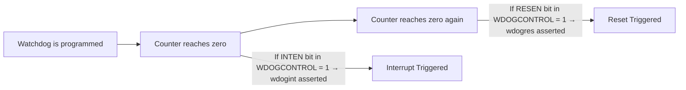

# 1. Scope

This document describes the design notes for the watchdog module on the MSCP side of the CPU v3 project, to facilitate understanding and usage of this module within the project team. It focuses on key information such as the watchdog module's functionality, interfaces, registers, and usage considerations.

# 2. Terms, Definitions, and Acronyms

# 3. Module Functionality

## 3.1. Technical Requirements

### 3.1.1. Module Functional Description

- Configurable-interval 32-bit down counter;
- Timeout generates an interrupt output signal;
- If the previous timeout interrupt has not been cleared, a timeout in the current counting cycle generates a reset signal;
- LOCK register protects watchdog module registers from being modified by runaway software;
- ID registers uniquely identify the watchdog module.

### 3.1.3. Input Interface Requirements

Input interface signals: wclk, wclk_en, wrst_n. The wclk input is the working clock, wrst_n is the reset in the working clock domain. wclk_en is the clock gate in the working clock domain — the counter operates on the rising edge of wclk when wclk_en is asserted high.

### 3.1.4. Output Interface Requirements

Outputs wdogint and wdogres are in the wclk working clock domain. The signal list is as follows:

| Name    | Width | Type | Source/Destination | Description                                                        |
| ------- | ----- | ---- | ------------------ | ------------------------------------------------------------------ |
| wdogint | 1     | O    | System             | Watchdog interrupt signal; remains asserted if not serviced (fed)  |
| wdogres | 1     | O    | System             | Watchdog reset signal; remains asserted until system reset         |

# 4. Module Design

## 4.1. Module Logic Design

Workflow summary:
1. After configuring the Load value and Control parameters, the 32-bit down counter begins counting down.
2. When the counter reaches zero, depending on the control register configuration:
    - If `INTEN` is 1, the `wdogint` interrupt is triggered.
    - If `RESEN` is 1, a second zero-count triggers the `wdogres` reset.
3. The interrupt status can be viewed/cleared via the interrupt status register.

The system first configures the watchdog LOCK register to unlock write access to subsequent critical registers, and reads the corresponding peripheral and version information. Then it configures the control register and reload value register to start the watchdog module's down counting. The watchdog timer workflow is as follows:

### 4.1.5. Module Reset Description

This module has two reset signals: APB bus reset signal prst_n (asynchronous reset) and wclk clock domain reset signal wrst_n (asynchronous reset).

## 4.2. Module Register Description

**4.2.1. Watchdog Module Register Overview**

The watchdog module contains a total of 21 registers, including: reload value register WDOGLOAD, current value register WDOGVALUE, control register WDOGCONTROL, interrupt clear register WDOGINTCLR, raw interrupt status register WDOGRIS, masked interrupt status register WDOGMIS, LOCK register WDOGLOCK, integration test registers WDOGITCR and WDOGITOP, peripheral identification registers WDOGPERIPHID0–7, and PrimeCell identification registers WDOGPCELLID0–3.

**4.2.2. Watchdog Load Register [0x00]**

Watchdog module reload value register.

Address: 0x00

Register name: WDOGLOAD

Width: 32 bits

Type: Read/Write

Reset value: 0xFFFFFFFF

Table 4 — WDOGLOAD register bit assignments

| Bit  | Name      | R/W | Reset      | Description                              |
| ---- | --------- | --- | ---------- | ---------------------------------------- |
| 31-0 | wdog_load | R/W | 0xFFFFFFFF | Watchdog down counter reload value       |

**4.2.3. Watchdog Value Register [0x04]**

Watchdog module current value register for the down counter. Reading this register returns the current count value of the down counter.

Address: 0x04

Register name: WDOGVALUE

Width: 32 bits

Type: Read-only

Reset value: 0xFFFFFFFF

Table 5 — WDOGVALUE register bit assignments

| Bit  | Name       | R/W | Reset      | Description                                                                                                                                                                                                                                  |
| ---- | ---------- | --- | ---------- | -------------------------------------------------------------------------------------------------------------------------------------------------------------------------------------------------------------------------------------------- |
| 31-0 | count_read | R   | 0xFFFFFFFF | The current value of watchdog counter. 0xFFFFFFFF: current value is 0xFFFFFFFF; 0xFFFFFFFE: current value is 0xFFFFFFFE; ...; 0x00000001: current value is 0x00000001; 0x00000000: current value is 0x00000000 |

**4.2.4. Watchdog Control Register [0x08]**

Watchdog module control register. This register controls the down counter step value, as well as reset, interrupt, and counter enable.

Address: 0x08

Register name: WDOGCONTROL

Width: 32 bits

Type: Read/Write

Reset value: 0x00

Table 6 — WDOGCONTROL register bit assignments

| Bit  | Name       | R/W | Reset  | Description                                                                                                                                                                                                                                                                                                                                  |
| ---- | ---------- | --- | ------ | -------------------------------------------------------------------------------------------------------------------------------------------------------------------------------------------------------------------------------------------------------------------------------------------------------------------------------------------- |
| 31-5 | Reserved   | -   | -      | Reserved                                                                                                                                                                                                                                                                                                                                     |
| 4-2  | step_value | R/W | 3'b000 | 3'b000 — step_value = 1, working clock frequency 1 GHz; 3'b001 — step_value = 2, 500 MHz; 3'b010 — step_value = 4, 250 MHz; 3'b011 — step_value = 8, 125 MHz; 3'b100 — step_value = 16, 62.5 MHz; Other: invalid |
| 1    | RESEN      | R/W | 1'b0   | Enable watchdog reset output, WDOGRES. Acts as a mask for the reset output. Set to 1 to enable the reset, or to 0 to disable the reset.                                                                                                                                                                                                     |
| 0    | INTEN      | R/W | 1'b0   | Enable the interrupt event, WDOGINT. Set to 1 to enable the counter and the interrupt. Reloads the counter from the value in WDOGLOAD when the interrupt is enabled after previously being disabled.                                                                                                                                          |

**4.2.5. Watchdog Interrupt Clear Register [0x0C]**

Watchdog module interrupt clear register. Writing any value to this register clears the watchdog interrupt signal and reloads the initial count value from the WDOGLOAD register.

Address: 0x0C

Register name: WDOGINTCLR

Width: 32 bits

Type: Write-only

Reset value: 0x00

**4.2.6. Watchdog Raw Interrupt Status Register [0x10]**

Watchdog module raw (unmasked) interrupt status register. This register indicates the status of the raw interrupt (WS0) generated by the watchdog module.

Address: 0x10

Register name: WDOGRIS

Width: 1 bit

Type: Read-only

Reset value: 1'b0

Table 7 — WDOGRIS register bit assignments

| Bit  | Name                   | R/W | Reset | Description                           |
| ---- | ---------------------- | --- | ----- | ------------------------------------- |
| 31-1 | reserved               | -   | -     | -                                     |
| 0    | raw watchdog interrupt | R   | 1'b0  | Raw interrupt status from the counter |

**4.2.7. Watchdog Masked Interrupt Status Register [0x14]**

Watchdog module masked interrupt status register. Bit[0] of this register is the logical AND of the WS0 bit in the WDOGRIS register and the INTEN bit in the WDOGCONTROL register (i.e., WS0 & INTEN), which equals the interrupt output value.

Address: 0x14

Register name: WDOGMIS

Width: 1 bit

Type: Read-only

Reset value: 1'b0

Table 8 — WDOGMIS register bit assignments

| Bit  | Name               | R/W | Reset | Description                              |
| ---- | ------------------ | --- | ----- | ---------------------------------------- |
| 31-1 | reserved           | -   | -     | -                                        |
| 0    | watchdog interrupt | R   | 1'b0  | Enabled (masked) interrupt status from the counter |

**4.2.8. Watchdog Lock Register [0xC00]**

Watchdog module LOCK register. This register controls write access to other registers, protecting the watchdog module registers from malicious modification by runaway software. Writing 0x1ACCE551 enables write access to other registers; writing any other value disables write access. Reading this register returns the lock status based on whether 0x1ACCE551 was written:

- 0 — Register write access enabled (unlocked)
- 1 — Register write access disabled (locked)

Address: 0xC00

Register name: WDOGLOCK

Width: 32 bits

Type: Read/Write

Reset value: 0x00000000

Table 9 — WDOGLOCK register bit assignments

| Bit  | Name      | R/W | Reset      | Description                                                                                                                                                                                                                                                  |
| ---- | --------- | --- | ---------- | ------------------------------------------------------------------------------------------------------------------------------------------------------------------------------------------------------------------------------------------------------------ |
| 31-0 | wdog_lock | R/W | 0x00000000 | Enable write access to all other registers by writing 0x1ACCE551. Disable write access by writing any other value. A read returns the lock status: 0x0 — write access to all other registers is enabled (unlocked); 0x1 — write access is disabled (locked). |

**4.2.9. Watchdog Integration Test Control Register [0xF00]**

Watchdog module integration test mode control register. This register controls the enable of integration test mode.

Address: 0xF00

Register name: WDOGITCR

Width: 1 bit

Type: Read/Write

Reset value: 1'b0

Table 10 — WDOGITCR register bit assignments

| Bit  | Name                          | R/W | Reset | Description                                                          |
| ---- | ----------------------------- | --- | ----- | -------------------------------------------------------------------- |
| 31-1 | reserved                      | -   | -     | -                                                                    |
| 0    | Integration test mode enable  | R/W | 1'b0  | 1 — Enter integration test mode; 0 — Normal down counting mode.     |

**4.2.10. Watchdog Integration Test Output Set Register [0xF04]**

Watchdog module integration test mode output register. When in integration test mode, this register directly drives the watchdog interrupt and reset outputs.

Address: 0xF04

Register name: WDOGITOP

Width: 2 bits

Type: Write-only

Reset value: 2'b00

Table 11 — WDOGITOP register bit assignments

| Bit  | Name                                    | R/W | Reset | Description                                              |
| ---- | --------------------------------------- | --- | ----- | -------------------------------------------------------- |
| 31-2 | reserved                                | -   | -     | -                                                        |
| 1    | Integration test mode WDOGINT value     | W   | 1'b0  | Watchdog interrupt output value in integration test mode |
| 0    | Integration test mode WDOGRES value     | W   | 1'b0  | Watchdog reset output value in integration test mode     |

**4.2.11. Watchdog Peripheral Identification Register 4 [0xFD0]**

Watchdog module peripheral identification register 4.

Address: 0xFD0

Register name: WDOGPERIPHID4

Width: 8 bits

Type: Read-only

Reset value: 0x04

Table 12 — WDOGPERIPHID4 register bit assignments

| Bit  | Name             | R/W | Reset | Description                                      |
| ---- | ---------------- | --- | ----- | ------------------------------------------------ |
| 31-8 | reserved         | -   | -     | -                                                |
| 7-0  | WDOG_PERIPH_ID4  | R   | 0x04  | [7:4] — block count; [3:0] — JEP106_c_code      |

**4.2.12. Watchdog Peripheral Identification Register 5 [0xFD4]**

Watchdog module peripheral identification register 5.

Address: 0xFD4

Register name: WDOGPERIPHID5

Width: 8 bits

Type: Read-only

Reset value: 0x00

Table 13 — WDOGPERIPHID5 register bit assignments

| Bit  | Name             | R/W | Reset | Description                          |
| ---- | ---------------- | --- | ----- | ------------------------------------ |
| 31-8 | reserved         | -   | -     | -                                    |
| 7-0  | WDOG_PERIPH_ID5  | R   | 0x00  | Peripheral ID register 5, not used   |

**4.2.13. Watchdog Peripheral Identification Register 6 [0xFD8]**

Watchdog module peripheral identification register 6.

Address: 0xFD8

Register name: WDOGPERIPHID6

Width: 8 bits

Type: Read-only

Reset value: 0x00

Table 14 — WDOGPERIPHID6 register bit assignments

| Bit  | Name             | R/W | Reset | Description                          |
| ---- | ---------------- | --- | ----- | ------------------------------------ |
| 31-8 | reserved         | -   | -     | -                                    |
| 7-0  | WDOG_PERIPH_ID6  | R   | 0x00  | Peripheral ID register 6, not used   |

**4.2.14. Watchdog Peripheral Identification Register 7 [0xFDC]**

Watchdog module peripheral identification register 7.

Address: 0xFDC

Register name: WDOGPERIPHID7

Width: 8 bits

Type: Read-only

Reset value: 0x00

Table 15 — WDOGPERIPHID7 register bit assignments

| Bit  | Name             | R/W | Reset | Description                          |
| ---- | ---------------- | --- | ----- | ------------------------------------ |
| 31-8 | reserved         | -   | -     | -                                    |
| 7-0  | WDOG_PERIPH_ID7  | R   | 0x00  | Peripheral ID register 7, not used   |

**4.2.15. Watchdog Peripheral Identification Register 0 [0xFE0]**

Watchdog module peripheral identification register 0.

Address: 0xFE0

Register name: WDOGPERIPHID0

Width: 8 bits

Type: Read-only

Reset value: 0x24

Table 16 — WDOGPERIPHID0 register bit assignments

| Bit  | Name             | R/W | Reset | Description            |
| ---- | ---------------- | --- | ----- | ---------------------- |
| 31-8 | reserved         | -   | -     | -                      |
| 7-0  | WDOG_PERIPH_ID0  | R   | 0x24  | Part number [7:0]      |

**4.2.16. Watchdog Peripheral Identification Register 1 [0xFE4]**

Watchdog module peripheral identification register 1.

Address: 0xFE4

Register name: WDOGPERIPHID1

Width: 8 bits

Type: Read-only

Reset value: 0xB8

Table 17 — WDOGPERIPHID1 register bit assignments

| Bit  | Name             | R/W | Reset | Description                                        |
| ---- | ---------------- | --- | ----- | -------------------------------------------------- |
| 31-8 | reserved         | -   | -     | -                                                  |
| 7-0  | WDOG_PERIPH_ID1  | R   | 0xB8  | [7:4] — JEP106_id_3_0; [3:0] — part number [11:8] |

**4.2.17. Watchdog Peripheral Identification Register 2 [0xFE8]**

Watchdog module peripheral identification register 2.

Address: 0xFE8

Register name: WDOGPERIPHID2

Width: 8 bits

Type: Read-only

Reset value: 0x1B

Table 18 — WDOGPERIPHID2 register bit assignments

| Bit  | Name             | R/W | Reset | Description                                              |
| ---- | ---------------- | --- | ----- | -------------------------------------------------------- |
| 31-8 | reserved         | -   | -     | -                                                        |
| 7-0  | WDOG_PERIPH_ID2  | R   | 0x1B  | [7:4] — Revision; [3] — JEDEC_used; [2:0] — JEP106_id_6_4 |

**4.2.18. Watchdog Peripheral Identification Register 3 [0xFEC]**

Watchdog module peripheral identification register 3.

Address: 0xFEC

Register name: WDOGPERIPHID3

Width: 8 bits

Type: Read-only

Reset value: 0x00

Table 19 — WDOGPERIPHID3 register bit assignments

| Bit  | Name             | R/W | Reset | Description                      |
| ---- | ---------------- | --- | ----- | -------------------------------- |
| 31-8 | reserved         | -   | -     | -                                |
| 7-4  | ECOREVNUM        | R   | 0x0   | ECO revision number              |
| 3-0  | WDOG_PERIPH_ID3  | R   | 0x0   | Customer modification number     |

**4.2.19. Watchdog PrimeCell Identification Register 0 [0xFF0]**

Watchdog module PrimeCell identification register 0.

Address: 0xFF0

Register name: WDOGPCELLID0

Width: 8 bits

Type: Read-only

Reset value: 0x0D

Table 20 — WDOGPCELLID0 register bit assignments

| Bit  | Name            | R/W | Reset | Description              |
| ---- | --------------- | --- | ----- | ------------------------ |
| 31-8 | reserved        | -   | -     | -                        |
| 7-0  | WDOG_PCELL_ID0  | R   | 0x0D  | Component ID register 0  |

**4.2.20. Watchdog PrimeCell Identification Register 1 [0xFF4]**

Watchdog module PrimeCell identification register 1.

Address: 0xFF4

Register name: WDOGPCELLID1

Width: 8 bits

Type: Read-only

Reset value: 0xF0

Table 21 — WDOGPCELLID1 register bit assignments

| Bit  | Name            | R/W | Reset | Description              |
| ---- | --------------- | --- | ----- | ------------------------ |
| 31-8 | reserved        | -   | -     | -                        |
| 7-0  | WDOG_PCELL_ID1  | R   | 0xF0  | Component ID register 1  |

**4.2.21. Watchdog PrimeCell Identification Register 2 [0xFF8]**

Watchdog module PrimeCell identification register 2.

Address: 0xFF8

Register name: WDOGPCELLID2

Width: 8 bits

Type: Read-only

Reset value: 0x05

Table 22 — WDOGPCELLID2 register bit assignments

| Bit  | Name            | R/W | Reset | Description              |
| ---- | --------------- | --- | ----- | ------------------------ |
| 31-8 | reserved        | -   | -     | -                        |
| 7-0  | WDOG_PCELL_ID2  | R   | 0x05  | Component ID register 2  |

**4.2.22. Watchdog PrimeCell Identification Register 3 [0xFFC]**

Watchdog module PrimeCell identification register 3.

Address: 0xFFC

Register name: WDOGPCELLID3

Width: 8 bits

Type: Read-only

Reset value: 0xB1

Table 23 — WDOGPCELLID3 register bit assignments

| Bit  | Name            | R/W | Reset | Description              |
| ---- | --------------- | --- | ----- | ------------------------ |
| 31-8 | reserved        | -   | -     | -                        |
| 7-0  | WDOG_PCELL_ID3  | R   | 0xB1  | Component ID register 3  |
